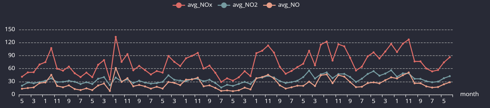

# NoSQL Air Quality Modelling

Air quality data was modelled and uploaded to a Quest DB database. The model has a dedicated timeseries table for air quality readings that can be rapidly updated and queried, and analysed using efficient timeseries-specific commands. There are also three relational tables that aren't timeseries indexed to contain data to augment the readings values: stations, constituencies, and measures.

## Why QuestDB

Quest DB is a database system that has been designed to store and query timeseries data. This makes it a great option for the air quality sensor readings, which create timeseries data. Other attractions were that its syntax is extremely SQL-like, making learning it user friendly, and that its easy to get an instance working. Its open source with lots of options for downloading and hosting it, meaning my project will be easy for someone else to replicate. I chose to use a docker image for my instance of Quest. 

## The Model

The data model used in quest was similar in structure to one that would be used in a relational database. There are four tables:
    - readings 
    - stations
    - constituencies
    - measures

This model is fully normalized. This is unusual for a NoSQL database, as a reason to chose a NoSQL solution is maximizing query speed, and a denormalized approach eliminates the need for joins speeding up reading all the data. I started off taking this approach, designing a single table to contain a universal relation, with all the data for readings, stations and constituencies. This would include repeating groups such as the site id / station name. 

However, a particular use case of Quest for our data is to minimize write time rather than read time. Quest claims to be capable of "hyper ingestion", handling millions of rows written per second (QuestDB, n.d., https://questdb.com/docs/why-questdb/). This allows us to imagine scaling our project to one involving thousands of sensors taking readings every minute. 

In this case, each reading would require pre-processing before being loaded to the db if we want a single wide table because some of the information is supplemental and not provided by the sensor, such as the constituency name and station name. If we are designing a model that can scale, this manipulation for every row becomes inefficient. 

Instead, this information can be stored in separate tables because these values only need to be updated periodically. For example, a new sensor may be added every few months, and the names and boundaries of a constituency might change every decade. By splitting these data into separate tables we're being efficient with both storage and processing.

I considered some alternatives:

    - Using this schema, but using a timeseries index for the stations and constituencies as well. This would mean that each has a key for site_id / constituency_id, but additionally has a timestamp representing when that row was created. This would mean that each time data for a site or constituency changed, a new row is appended to the table. We then make use of Quest's "AS OF" joins, joining from a reading the most recent row in stations that was created before the reading occurred. 
    This way, the data always represent what is true when the reading was taken. For example, when new constituencies are created in 2024, new rows are added to the constituency table. Sites taking readings after the change would join to the new names, but readings from the same site in 2023 would join to the old consituency. 
    I didn't implement this approach in order to keep the queries less complex. 

    - To use polyglottal persistence, leveraging the fast and flexible traits of a key-value database like couchbase to store the readings from the sensor, and a separate relational database system like postgres for storing the static sensor metadata. These two sources of data would then be unified on the application level. This approach would have been overkill for this assignment because it would involve designing an application to abstract away the two databases and provide a single api to the user. 

    - Using extensions to postgres. There's one called postGIS for optimized storage of geospacial data. This allows us to store the coordinates of the sensors and the geometry of the constituency borders in columns of their respective tables, and join them where the coordinate point is inside the boundary polygon. This would allow the changes to the constituency boundaries in 2024 to be seamless because it would only involve updating the geometry in the table, not changing the constituency IDs for each sensor, reducing the chance of update anomolies. 
    Timescale is an extension to postgres for timeseries data. These two are compatible, and would have lead to an interesting solution that was optimized for both the timeseries nature of readings and the geospacial data. This would have been the best approach if producing visualizations such as choropleth maps showing the concentration of pollutants on a map of Bristol. I hope to try this one day as a personal project. 
    For this project, I was happy to learn about geospacial data through using geopandas library, and use what I considered to be the best database for timeseries data. 

There's a description for setting up the model in README.md

## Issues and Challenges

One reason to use quest was its dedicated language libraries. The python api seemed convenient as it interfaced directly with pandas dataframes. However, I had issues using the Sender object in the python library - the tables I created couldn't be read from. Since I was running the db using a docker image, I mounted a folder to the image and inspected what was happening to the files when I used the Sender object. I saw that data partitions were created for the `readings` table, indexed from 1. Then, the select statement errorred because it could not find the file with the suffix "_0". When I manually updated the name of the file, the select would work but I was unable to find a solution without extra intervention after my python script ran. 

The work around I used is one I stumbled across while inspecting the quest volume. There's a folder named "import", and parquet files within it can be queried directly. I wrote a python script that took the data, wrote it as parquet to this folder, then sent a statement via http request to create the tables as a selects from the parquets. This is a perfectly workable solution, but feels clunky and its a shame I couldn't get the python client working.

However, it gave me exposure to http requests which was a learning event. I struggled because I used a POST request since I was adding data. I didn't get the script to work until I changed this to GET as a guess. I will read more about why using post was a mistake. 

I was still able to implement my model using python. This is a learning goal I imposed on myself as I wanted to be comfortable implementing DMF in code. 

When designing the model, I spent some time wavering between denormalized and normalized approaches. In the end, I am happy with the balanced solution I came up with, which I justify in the above section. I'm please that I was able to feel confident in my final solution as persistence architecture is a key learning object of the DMF course that I wanted to focus on. 

## Querying the Model

When querying the model, I wanted to take advantage of Quest's unique time series features. For example, using the 'sample by' clause to calculate the average concentration of NOx by month:

```
select
  month(datetime)  as month
  ,year(datetime) as year
  ,avg(NOx) as avg_NOx
  ,avg(NO2) as avg_NO2
  ,avg(NO) as avg_NO
from 
  readings r 
inner join 
  stations s
  on r.site_id = s.site_id
where 
  s.station_name = 'Temple Way'
sample by 
  1M
order by 
  1 desc
  ,2 desc
```

The sample by clause takes a range of time intervals, and its easy to imagine this implemented in an embedded script where the value is set dynamically by an interactive feature in a webapp. 

This chart of the results was created in the browser console:



Here's an example giving the most recent NO2 value for each station using `LATEST ON`:

```
select
  s.station_name
  ,NO2
from 
  readings r 
inner join 
  stations s 
  on 
  r.site_id = s.site_id
latest on  
  datetime partition by site_id
```

results: 

We can see how this would be useful for creating a live dashboard. 

I have included other screen captures of queries and their results in the folder `.\quest_queries\`